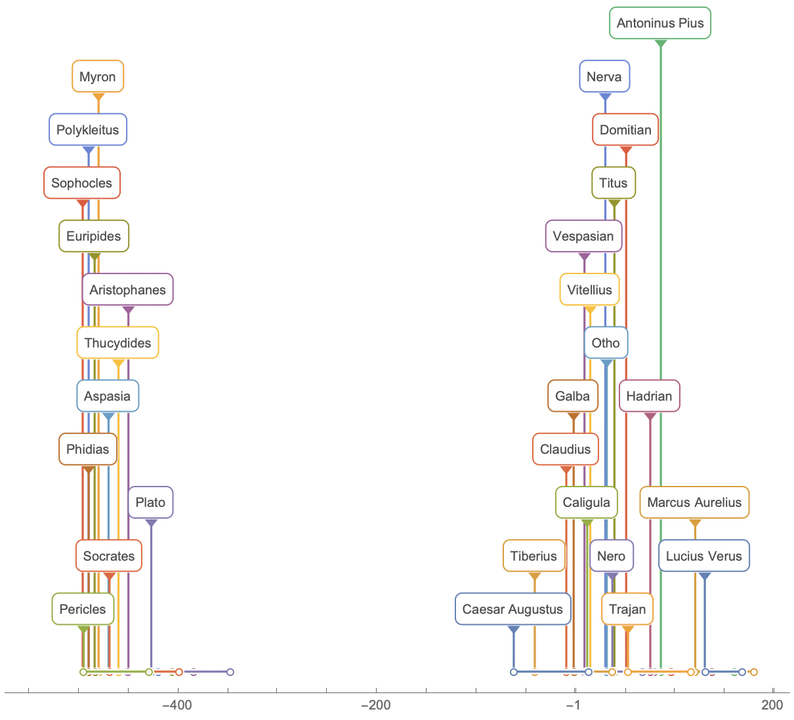

## Introduction

In this project, you will use the Wolfram Language to create a timeline showing the lifetimes of people in a specific period of history.

### What you will make

--- print-only ---
 
--- /print-only ---

--- collapse ---
---
title: What you will need
---
### Hardware

+ A computer: desktop, laptop, or a Raspberry Pi

### Software

+ Wolfram Language, available for free on the Raspberry Pi as part of the official operating system, Raspbian

--- /collapse ---

--- collapse ---
---
title: What you will learn
---

+ How to use Free-Form Linguistic Input
+ How to extract properties from entities.
+ How to sort entities using a pattern
+ How to create a function

--- /collapse ---

--- collapse ---
---
title: Additional information for educators
---

If you need to print this project, please use the [printer-friendly version](https://projects.raspberrypi.org/en/projects/wolfram-timeline/print){:target="_blank"}.

[Here is a link to the resources for this project](http://rpf.io/project-name-go).

--- /collapse ---

