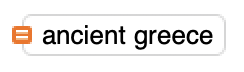
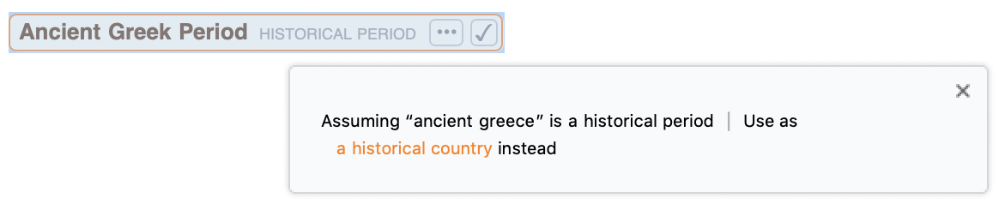
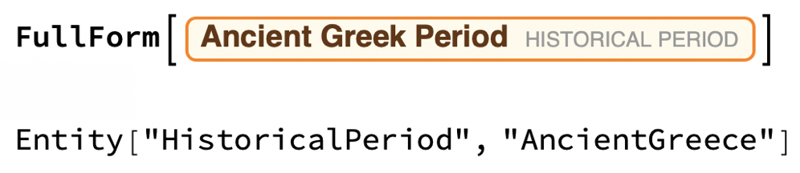
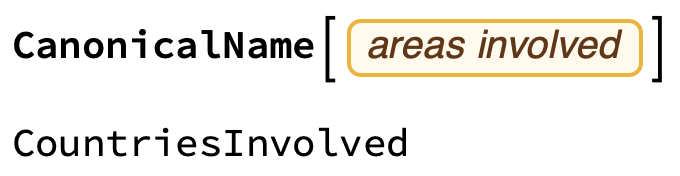

## Discovering an era

--- task ---

If you have never used the Wolfram Language before, follow [this guide to get started](https://projects.raspberrypi.org/en/projects/getting-started-with-mathematica) and learn to use the tool. Look at the sections **Starting Mathematica** and **Programming in Mathematica**.

--- /task ---

To start, you will use Wolfram|Alpha and Free-Form Linguistic Input to find out about a period in history.

--- task ---

Click between any two cells in your notebook and press equals (`=`) twice. This should make an orange star appear: . The cell is now ready to search Wolfram|Alpha (alternatively, you can [go to the website directly](https://www.wolframalpha.com/) and search there).

Type in a period or people in history and hit enter to find out more about it.
For example, try searching for "Ancient Greece".

--- /task ---

Many historical periods are built in to the Wolfram Language, each as an `Entity`. Entities are objects of a given type--for example, planets, countries, elements, and so on--with built-in properties.

Entities can be found most easily by using the Wolfram's Free-Form Linguistic Input.

--- task ---

In a new cell in your notebook, press `Ctrl` + `=`. This should make a little input field appear: .

Type in a historical period and hit enter.

There may be multiple interpretations of your input. If so, click the three dots to choose the one you want, then click the tick to confirm your choice. For example:

TODO: merge these into one image and add arrows between them.




Alternatively, choose from the built-in list of available entities by evaluating `HistoricalPeriodData[]`.

One you have your historical period entity, see its raw code form with the function `FullForm`. For example:

TODO: Should this have input/output numbers showing? Same applies to later images.


This is also what will appear if you try to copy your entity into a text file.

--- /task ---

Once you have an entity, its properties can be extracted in one of two ways, as shown below. The first way is more "powerful" because it works on lists of entities as well as single ones.

--- task ---

Use the `"Properties"` option to find out what properties your entity has.

```
EntityValue[<your entity>, "Properties"]
```
```
<your entity>["Properties"]
```

Use the function `CanonicalName` to find the option name associated with each `EntityProperty` in the property list. For example:



Use the "start date" and "end date" options to find out when your historical period started and ended.

--- hints ---

--- hint ---

The canonical names for "start date" and "end date" are "StartDate" and "EndDate".

--- /hint ---

--- hint ---

Here's the start date for the Ancient Greek period (with the entity shown in its raw form):

```
EntityValue[Entity["HistoricalPeriod", "AncientGreece"], "StartDate"]
```

--- /hint ---

--- /hints ---

You can visualise your historical period on a timeline with the function `TimelinePlot`.

--- task ---

Plot a timeline of your historical period.

```
TimelinePlot[<your entity>]
```
TODO: Add an image.


--- /task ---